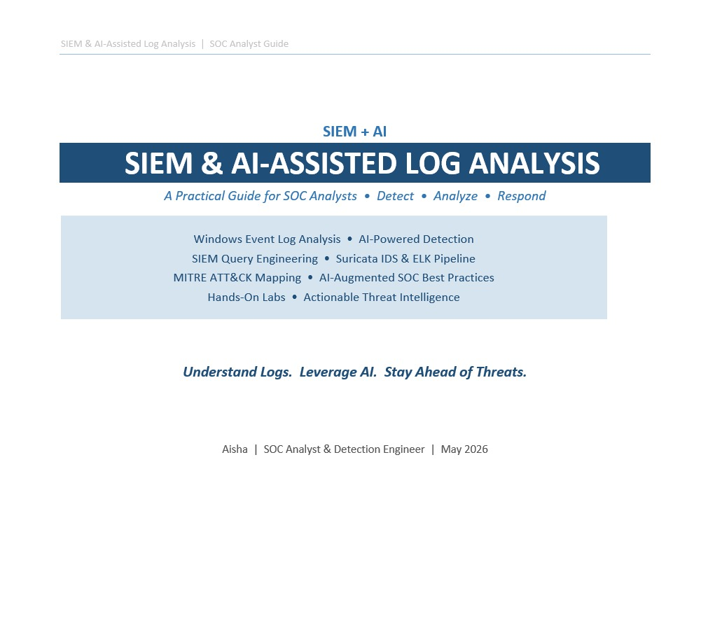
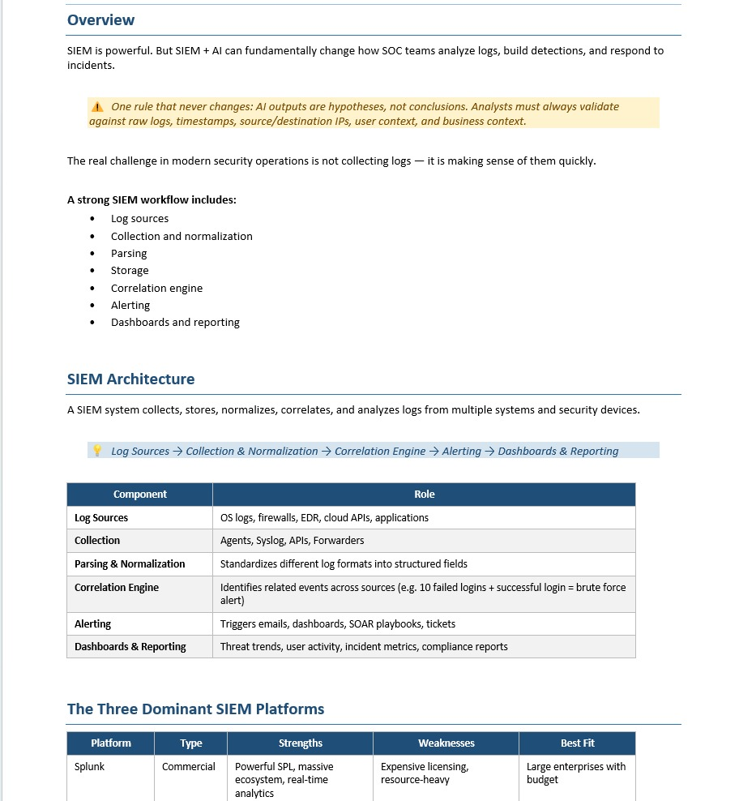
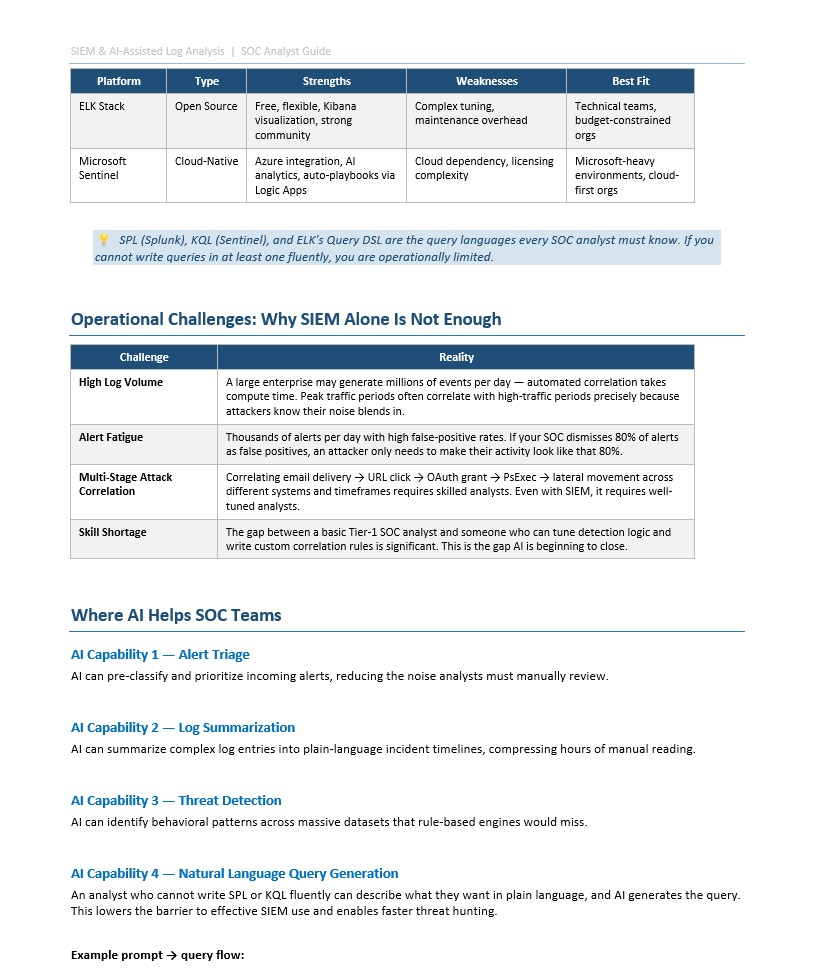
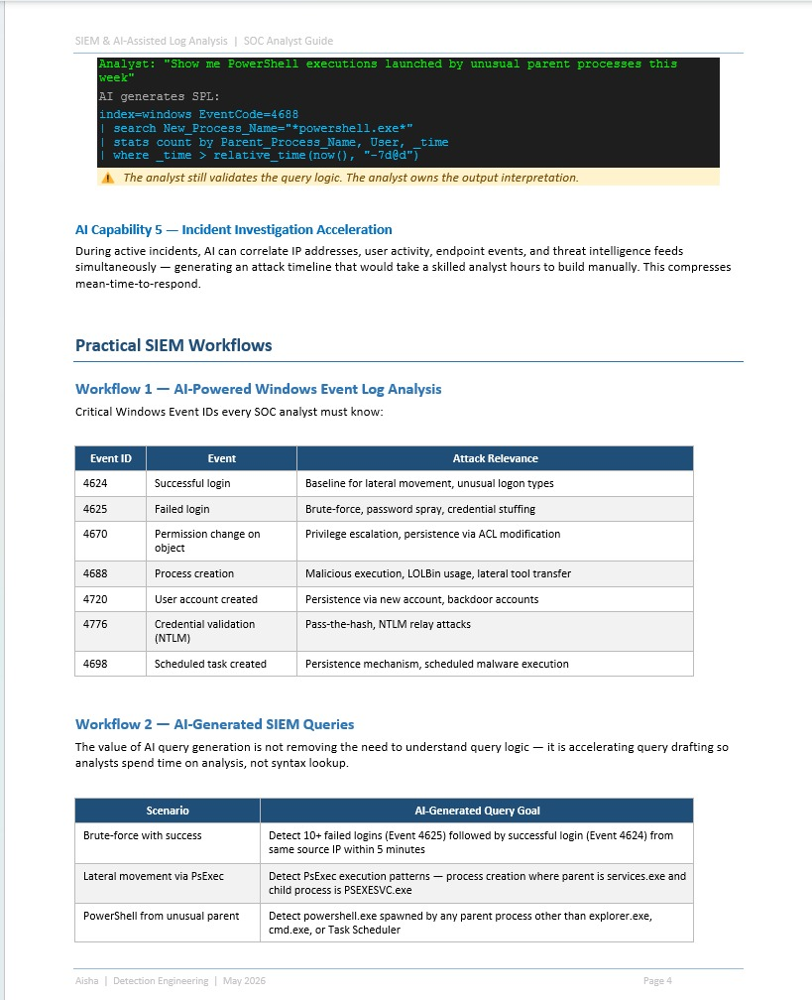
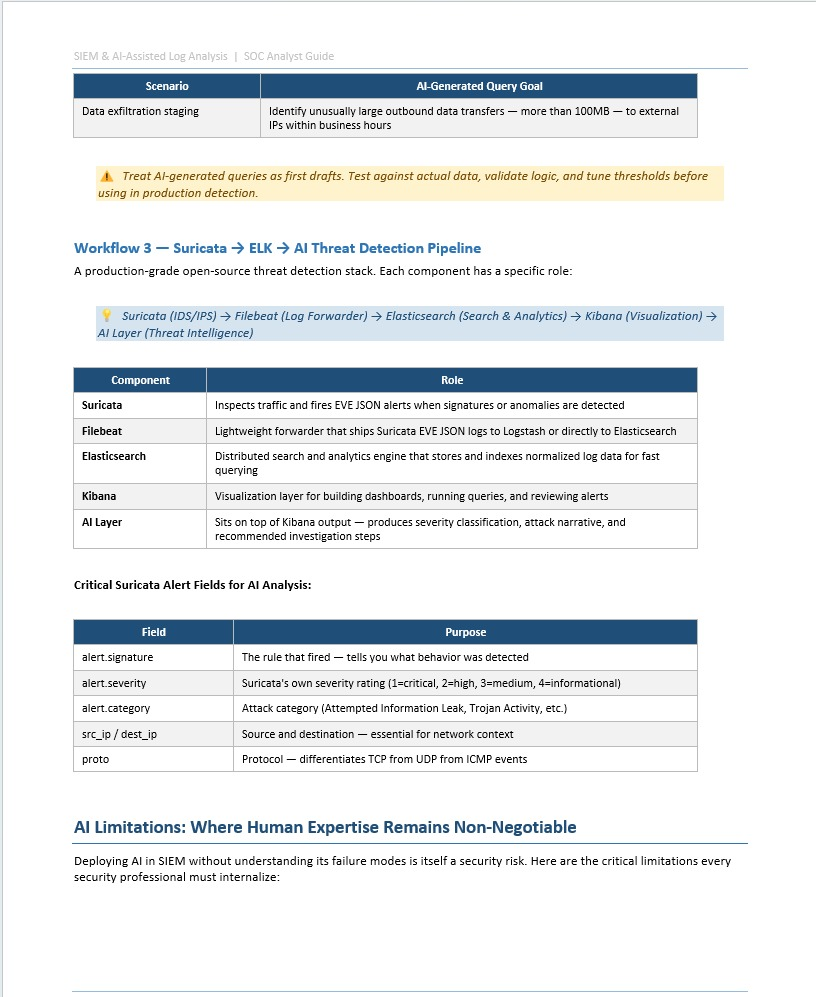
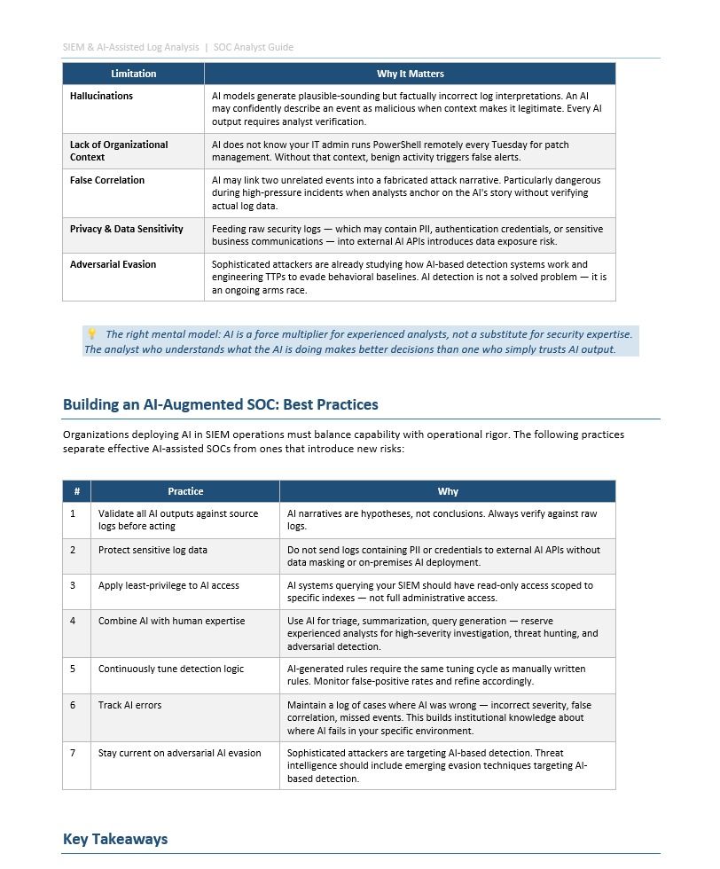
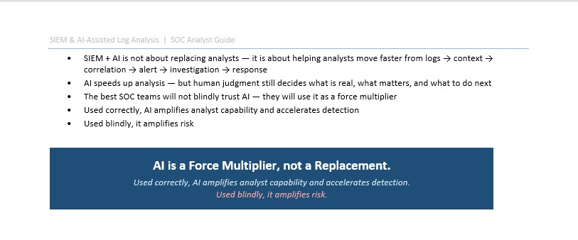

# 🧠 SIEM & AI-Assisted Detection Lab


> **SOC Blue Team Lab** | SIEM Architecture | AI-Powered Detection | Windows Event IDs | Suricata → ELK → AI Pipeline

---

## 📚 Visual Reference Guide

> The following visuals are from the original hand-drawn guide by [Amresh Kumar](https://www.linkedin.com/in/amresh-kumar-ak/) — used as the theoretical foundation for this lab.







---

## 📌 Overview

SIEM is powerful. But **SIEM + AI** can fundamentally change how SOC teams analyze logs, build detections, and respond to incidents.

> ⚠️ **One rule that never changes:** AI outputs are **hypotheses**, not conclusions. Analysts must always validate against raw logs, timestamps, source/destination IPs, user context, and business context.

The real challenge in modern security operations is not collecting logs — it is **making sense of them quickly**.

A strong SIEM workflow includes:
- Log sources
- Collection and normalization
- Parsing
- Storage
- Correlation engine
- Alerting
- Dashboards and reporting

---

## 🏗️ SIEM Architecture

A SIEM system collects, stores, normalizes, correlates, and analyzes logs from multiple systems and security devices.

| Component | Role |
|-----------|------|
| **Log Sources** | OS logs, firewalls, EDR, cloud APIs, applications |
| **Collection** | Agents, Syslog, APIs, Forwarders |
| **Parsing & Normalization** | Standardizes different log formats into structured fields |
| **Correlation Engine** | Identifies related events across sources — 10 failed logins + successful login = brute force alert |
| **Alerting** | Triggers emails, dashboards, SOAR playbooks, tickets |
| **Dashboards & Reporting** | Threat trends, user activity, incident metrics, compliance reports |



---

## 🔧 The Three Dominant SIEM Platforms

| Platform | Type | Strengths | Weaknesses | Best Fit |
|----------|------|-----------|------------|----------|
| **Splunk** | Commercial | Powerful SPL, massive ecosystem, real-time analytics | Expensive licensing, resource-heavy | Large enterprises with budget |
| **ELK Stack** | Open Source | Free, flexible, Kibana visualization, strong community | Complex tuning, maintenance overhead | Technical teams, budget-constrained orgs |
| **Microsoft Sentinel** | Cloud-Native | Azure integration, AI analytics, auto-playbooks via Logic Apps | Cloud dependency, licensing complexity | Microsoft-heavy environments, cloud-first orgs |

> 💡 SPL (Splunk), KQL (Sentinel), and ELK's Query DSL are the query languages every SOC analyst must know. If you cannot write queries in at least one fluently, you are operationally limited.



---

## ⚠️ Operational Challenges: Why SIEM Alone Is Not Enough

| Challenge | Reality |
|-----------|---------|
| **High Log Volume** | A large enterprise may generate millions of events per day — automated correlation takes compute time. Attackers know their noise blends in during peak traffic periods. |
| **Alert Fatigue** | If your SOC dismisses 80% of alerts as false positives, an attacker only needs to make their activity look like that 80%. |
| **Multi-Stage Attack Correlation** | Correlating email delivery → URL click → OAuth grant → PsExec → lateral movement across different systems and timeframes requires skilled analysts. |
| **Skill Shortage** | The gap between a basic Tier-1 SOC analyst and someone who can tune detection logic and write custom correlation rules is significant. This is the gap AI is beginning to close. |

---

## 🤖 Where AI Helps SOC Teams

| AI Capability | What It Does |
|---------------|-------------|
| **Alert Triage** | Pre-classifies and prioritizes incoming alerts — reducing noise analysts must manually review |
| **Log Summarization** | Summarizes complex log entries into plain-language incident timelines — compressing hours of manual reading |
| **Threat Detection** | Identifies behavioral patterns across massive datasets that rule-based engines would miss |
| **Natural Language Query Generation** | Analyst describes what they want in plain language — AI generates the SPL/KQL query |
| **Incident Investigation Acceleration** | Correlates IP addresses, user activity, endpoint events, and threat intel feeds simultaneously — generates attack timeline in minutes |

**Example — AI Natural Language → SPL Query:**

```bash
# Analyst says:
"Show me PowerShell executions launched by unusual parent processes this week"

# AI generates:
index=windows EventCode=4688
| search New_Process_Name="*powershell.exe*"
| stats count by Parent_Process_Name, User, _time
| where _time > relative_time(now(), "-7d@d")
```

> ⚠️ The analyst still validates the query logic. **The analyst owns the output interpretation — not the AI.**



---

## 🛠️ Practical SIEM Workflows

### Workflow 1 — AI-Powered Windows Event Log Analysis

Critical Windows Event IDs every SOC analyst must know:

| Event ID | Event | Attack Relevance |
|----------|-------|-----------------|
| **4624** | Successful login | Baseline for lateral movement, unusual logon types |
| **4625** | Failed login | Brute-force, password spray, credential stuffing |
| **4670** | Permission change on object | Privilege escalation, persistence via ACL modification |
| **4688** | Process creation | Malicious execution, LOLBin usage, lateral tool transfer |
| **4720** | User account created | Persistence via new account, backdoor accounts |
| **4776** | Credential validation (NTLM) | Pass-the-hash, NTLM relay attacks |
| **4698** | Scheduled task created | Persistence mechanism, scheduled malware execution |

### Workflow 2 — AI-Generated SIEM Queries

| Scenario | AI-Generated Query Goal |
|----------|------------------------|
| **Brute-force with success** | Detect 10+ failed logins (Event 4625) followed by successful login (Event 4624) from same source IP within 5 minutes |
| **Lateral movement via PsExec** | Detect PsExec execution patterns — process creation where parent is services.exe and child is PSEXESVC.exe |
| **PowerShell from unusual parent** | Detect powershell.exe spawned by any parent other than explorer.exe, cmd.exe, or Task Scheduler |
| **Data exfiltration staging** | Identify outbound data transfers over 100MB to external IPs within business hours |

> ⚠️ Treat AI-generated queries as first drafts. Test against actual data, validate logic, and tune thresholds before using in production detection.


---

### Workflow 3 — Suricata → ELK → AI Threat Detection Pipeline

> A production-grade fully open-source threat detection stack. Each component has a specific role.

| Component | Role |
|-----------|------|
| **Suricata** | Network IDS/IPS — inspects traffic and fires EVE JSON alerts when signatures or anomalies are detected |
| **Filebeat** | Log forwarder — ships Suricata EVE JSON logs to Logstash or directly to Elasticsearch |
| **Elasticsearch** | Search and analytics engine — stores and indexes normalized log data for fast querying |
| **Kibana** | Visualization layer — builds dashboards, runs queries, and displays alerts |
| **AI Layer** | Sits on top of Kibana output — produces severity classification, attack narrative, and recommended investigation steps |

**Critical Suricata Alert Fields to extract for AI Analysis:**

| Field | Purpose |
|-------|---------|
| `alert.signature` | The rule that fired — tells you exactly what behavior was detected |
| `alert.severity` | Suricata severity rating — 1=critical, 2=high, 3=medium, 4=informational |
| `alert.category` | Attack category — Attempted Information Leak, Trojan Activity, etc. |
| `src_ip / dest_ip` | Source and destination IPs — essential for network context |
| `proto` | Protocol — differentiates TCP from UDP from ICMP events |

> 💡 This pipeline represents the open-source equivalent of a commercial SOC stack — Suricata replaces a paid IDS, ELK replaces a paid SIEM, and AI replaces manual log triage.



---

## 🚨 AI Limitations: Where Human Expertise Remains Non-Negotiable

> Deploying AI in SIEM without understanding its failure modes is itself a security risk.

| Limitation | Why It Matters |
|-----------|---------------|
| **Hallucinations** | AI models generate plausible-sounding but factually incorrect log interpretations. An AI may confidently describe a benign event as malicious. Every AI output requires analyst verification. |
| **Lack of Organizational Context** | AI does not know your IT admin runs PowerShell remotely every Tuesday for patch management. Without that context, benign activity triggers false alerts. |
| **False Correlation** | AI may link two unrelated events into a fabricated attack narrative — particularly dangerous during high-pressure incidents when analysts anchor on the AI story without verifying actual log data. |
| **Privacy & Data Sensitivity** | Feeding raw security logs containing PII, authentication credentials, or sensitive business communications into external AI APIs introduces data exposure risk. |
| **Adversarial Evasion** | Sophisticated attackers are already studying how AI-based detection systems work and engineering TTPs to evade behavioral baselines. AI detection is not a solved problem — it is an ongoing arms race. |

> 🧠 **The right mental model:** AI is a force multiplier for experienced analysts, not a substitute for security expertise. The analyst who understands what the AI is doing makes better decisions than one who simply trusts AI output.


---

## ✅ Building an AI-Augmented SOC: Best Practices

| # | Practice | Why |
|---|----------|-----|
| 1 | Validate all AI outputs against source logs before acting | AI narratives are hypotheses, not conclusions |
| 2 | Protect sensitive log data | Do not send logs containing PII or credentials to external AI APIs without data masking |
| 3 | Apply least-privilege to AI access | AI systems querying your SIEM should have read-only access scoped to specific indexes |
| 4 | Combine AI with human expertise | Use AI for triage, summarization, query generation — reserve experienced analysts for high-severity investigation and threat hunting |
| 5 | Continuously tune detection logic | AI-generated rules require the same tuning cycle as manually written rules — monitor false-positive rates and refine accordingly |
| 6 | Track AI errors | Maintain a log of cases where AI was wrong — incorrect severity, false correlation, missed events |
| 7 | Stay current on adversarial AI evasion | Sophisticated attackers are targeting AI-based detection — threat intelligence should include emerging evasion techniques |


---

## 🧠 Key Takeaways

- **SIEM + AI is not about replacing analysts** — it is about helping analysts move faster from logs → context → correlation → alert → investigation → response
- **AI speeds up analysis** — but human judgment still decides what is real, what matters, and what to do next
- **The best SOC teams will not blindly trust AI** — they will use it as a force multiplier
- **Used correctly**, AI amplifies analyst capability and accelerates detection
- **Used blindly**, it amplifies risk

---

## 🛠️ Skills Demonstrated

`SIEM Architecture` `Log Analysis` `AI-Assisted Detection` `Splunk SPL` `KQL` `ELK Stack`
`Suricata IDS` `Windows Event IDs` `MITRE ATT&CK Mapping` `Threat Hunting`
`Detection Engineering` `AI Prompt Engineering` `SOC Operations` `Incident Investigation`

---

## 🔗 References

- [MITRE ATT&CK Framework](https://attack.mitre.org/)
- [Wazuh Documentation](https://documentation.wazuh.com/)
- [Elastic SIEM](https://www.elastic.co/security/siem)
- [Splunk Security Essentials](https://splunkbase.splunk.com/app/3435)
- Original visual guide by [Amresh Kumar](https://www.linkedin.com/in/amresh-kumar-ak/)

---

*Aisha | Information Security Analyst | 
